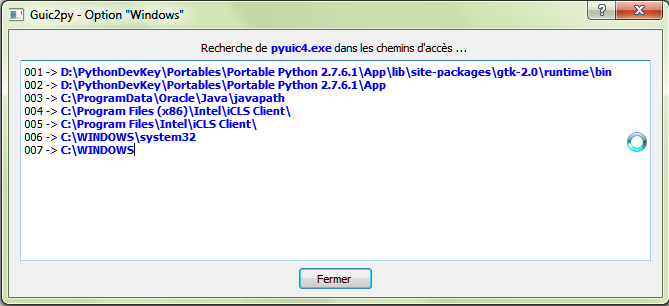
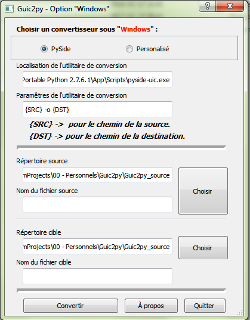
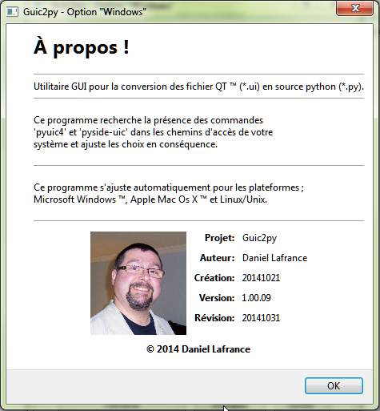

# Guic2py
Utility to help the conversion from *.ui file to Python class.
# Note:
  This app was used to generate it's own GUIs.
   Well, it's in French. Who said that all things must be easy. ;-)
# Pre-Requisites.
Python 2.7 or Higher. (Not Python 3)
 pyuic4 or pyside-uic. 
# Target OS
Works in Mac OS, Linux and Windows;.
# Description.

After discovering under which Os it run's, the app is then searching your path to find the available tools. </img>

Then the main window appear. The rest is self explanatory. </img>

Cute Guy. Is'nt he?. </img>

Have fun!

<G><I>Mac-Os is a Apple Computer Trademark, Windows is a Microsoft Corporation Trademark</i></g>

